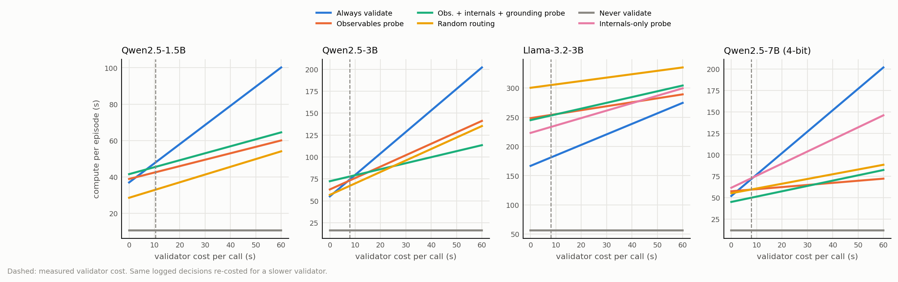
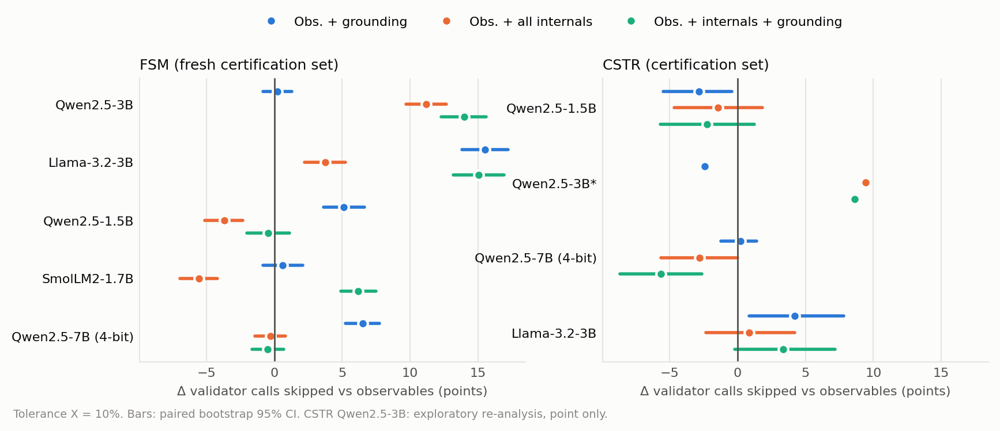
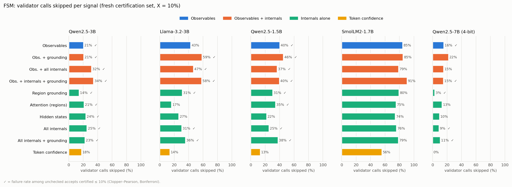
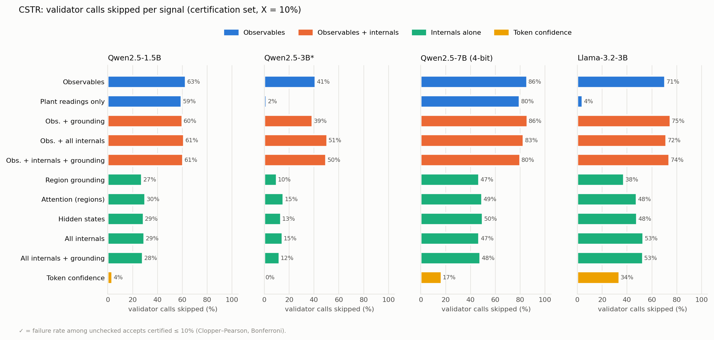
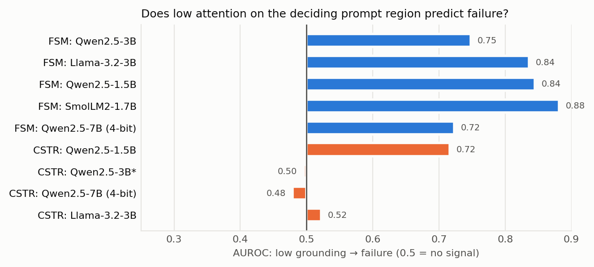
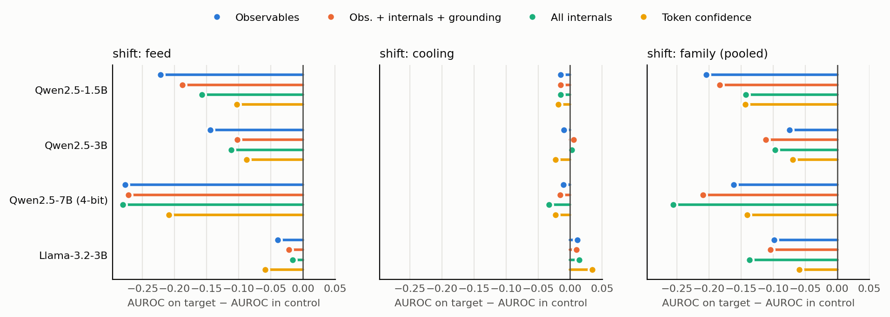

# Selective verification — campaign dashboard

_Generated 2026-10-07 12:10 by `scripts/48_dashboard.py` (git pre-commit hook). Previous commit: `f357b23 Dashboard: automatic status update`._

## Campaign status

| Step | Status |
|---|---|
| Llama-3.2-3B closed loop (resumed) | ✅ done |
| FSM Qwen2.5-7B: pilot inference | ✅ done |
| FSM Qwen2.5-7B: pilot grounding | ✅ done |
| FSM Qwen2.5-7B: cert2 inference | ✅ done |
| FSM Qwen2.5-7B: cert2 grounding | ✅ done |
| FSM Qwen2.5-7B: freeze + cert evaluation | ✅ done |
| CSTR SmolLM2-1.7B: 100-episode pilot (gate) | ✅ done (pass rate among valid, format-failure rate = 0.380 0.000) |
| CSTR SmolLM2-1.7B: full run + certification (if gate met) | ⏳ running |
| Closed loop, internals only: Qwen2.5-3B | 🕓 waiting |
| Closed loop, internals only: Qwen2.5-1.5B | 🕓 waiting |

<details><summary>Last 8 queue-log lines · 1 failure/skip line(s) in the log</summary>

```
2026-10-07T09:02:11 [model set] START fsm_qwen7_freeze
2026-10-07T09:02:42 [model set] END   fsm_qwen7_freeze (exit 0)
2026-10-07T09:02:42 [model set] START fsm_qwen7_cert2_eval
2026-10-07T09:02:58 [model set] END   fsm_qwen7_cert2_eval (exit 0)
2026-10-07T09:02:58 [model set] START cstr_smollm_pilot
2026-10-07T09:40:12 [model set] END   cstr_smollm_pilot (exit 0)
2026-10-07T09:40:12 [model set] SmolLM2 CSTR pilot: pass rate among valid, format-failure rate = 0.380 0.000
2026-10-07T09:40:12 [model set] START cstr_smollm_collect
```

</details>

## Closed-loop CSTR (400 fresh episodes per model; live)

Δ = change vs always-validate on the same episodes. Failing executed = failing actions executed without validation.

**Qwen2.5-1.5B** — complete (`20261003_181911_qwen25-15b`)

| Policy | Episodes | Recovered | Failing executed | Validator calls / ep (Δ) | Compute / ep |
|---|---|---|---|---|---|
| Always validate | 400 | 34.5% | 0 | 1.05 | 47 s |
| Observables probe | 400 | 33.0% (-1.5) | 12 | 0.35 (-67%) | 43 s |
| Obs. + internals + grounding | 400 | 33.2% (-1.2) | 9 | 0.38 (-64%) | 46 s |
| Random routing | 400 | 33.8% (-0.7) | 186 | 0.42 (-60%) | 33 s |
| Never validate | 400 | 34.5% (+0.0) | 259 | 0.00 (-100%) | 11 s |

**Qwen2.5-3B** — complete (`20261003_033144_qwen25-3b`)

| Policy | Episodes | Recovered | Failing executed | Validator calls / ep (Δ) | Compute / ep |
|---|---|---|---|---|---|
| Always validate | 400 | 43.8% | 0 | 2.45 | 75 s |
| Observables probe | 400 | 41.0% (-2.8) | 0 | 1.30 (-47%) | 73 s |
| Obs. + internals + grounding | 400 | 37.0% (-6.8) | 1 | 0.69 (-72%) | 77 s |
| Random routing | 400 | 37.8% (-6.0) | 110 | 1.31 (-47%) | 67 s |
| Never validate | 400 | 30.0% (-13.8) | 274 | 0.00 (-100%) | 16 s |

**Llama-3.2-3B** — complete (`20261004_151943_llama-32-3b`)

| Policy | Episodes | Recovered | Failing executed | Validator calls / ep (Δ) | Compute / ep |
|---|---|---|---|---|---|
| Always validate | 400 | 53.8% | 0 | 1.80 | 182 s |
| Observables probe | 400 | 35.2% (-18.5) | 0 | 0.68 (-62%) | 254 s |
| Obs. + internals + grounding | 400 | 44.5% (-9.2) | 0 | 0.99 (-45%) | 253 s |
| Internals only | 400 | 49.8% (-4.0) | 0 | 1.27 (-29%) | 233 s |
| Random routing | 400 | 29.5% (-24.2) | 0 | 0.58 (-68%) | 305 s |
| Never validate | 400 | 15.2% (-38.5) | 312 | 0.00 (-100%) | 57 s |

**Qwen2.5-7B (4-bit)** — complete (`20261004_225258_qwen25-7b`)

| Policy | Episodes | Recovered | Failing executed | Validator calls / ep (Δ) | Compute / ep |
|---|---|---|---|---|---|
| Always validate | 400 | 34.0% | 0 | 2.50 | 71 s |
| Observables probe | 400 | 25.0% (-9.0) | 8 | 0.24 (-90%) | 60 s |
| Obs. + internals + grounding | 400 | 26.5% (-7.5) | 165 | 0.62 (-75%) | 49 s |
| Internals only | 400 | 30.0% (-4.0) | 0 | 1.41 (-44%) | 73 s |
| Random routing | 400 | 19.2% (-14.8) | 107 | 0.55 (-78%) | 59 s |
| Never validate | 400 | 19.2% (-14.8) | 318 | 0.00 (-100%) | 12 s |

## Headline findings so far

- **FSM (fresh cert2, 4 models):** adding internals to observables skips +6 to +15 points more validator calls for 3 of 4 models at a certified failure rate; region grounding carries the gain for Llama and Qwen2.5-1.5B.
- **CSTR (4 models):** grounding never adds to observables; internals help only Qwen2.5-3B (accepts) and Llama (fewer good proposals rejected); internals alone skip 10–53% with 0 failing actions let through.
- **Shift:** internals are not more robust than observables to plant / fault shift (`docs/cstr_shift_results.md`).
- **Closed loop:** trained screens avoid 44–90% of validator calls with far fewer unsafe executions than random skipping; Qwen2.5-7B's combined probe fails on retries (accept unchecked only on first proposals fixes it); time savings grow with validator cost (`paper_outputs/tables/closed_loop_costs_all.md`).

## Validator calls skipped per signal (certification sets, X = 10%)

`*` = failure rate among unchecked accepts certified ≤ 10%. Full tables: `paper_outputs/tables/`.

**FSM (fresh cert2)** — cell: calls skipped (failing / accepted unchecked)

| Signal | Qwen2.5-3B | Llama-3.2-3B | Qwen2.5-1.5B | SmolLM2-1.7B | Qwen2.5-7B (4-bit) |
|---|---|---|---|---|---|
| Observables | 21%* (15/335) | 43% (26/333) | 40%* (7/284) | 85% (15/166) | 16%* (13/258) |
| Obs. + grounding | 21%* (11/339) | 59%* (20/444) | 46%* (1/228) | 85% (0/0) | 22% (41/513) |
| Obs. + all internals | 32%* (35/599) | 47%* (7/308) | 37%* (6/262) | 79% (0/0) | 15% (25/368) |
| Obs. + internals + grounding | 34%* (27/603) | 58%* (29/532) | 40%* (5/259) | 91% (7/146) | 15%* (17/375) |
| Region grounding | 14%* (18/367) | 31%* (2/102) | 31%* (5/178) | 80% (0/0) | 3%* (0/88) |
| Hidden states | 24%* (26/506) | 27% (13/204) | 22% (0/0) | 74% (0/0) | 10% (15/234) |
| All internals | 25%* (31/526) | 31%* (8/240) | 25%* (6/196) | 76% (0/0) | 9%* (12/252) |
| All internals + grounding | 23%* (21/483) | 36%* (13/371) | 38%* (8/240) | 79% (0/0) | 11%* (12/303) |
| Token confidence | 18% (28/329) | 14% (12/140) | 13% (0/0) | 56% (0/0) | 0% (0/0) |

**CSTR (cert)** — cell: calls skipped (failing / accepted unchecked)

| Signal | Qwen2.5-1.5B | Qwen2.5-3B* | Qwen2.5-7B (4-bit) | Llama-3.2-3B |
|---|---|---|---|---|
| Observables | 63% (14/121) | 41% (0/0) | 86% (2/54) | 71% (0/0) |
| Obs. + grounding | 60% (7/102) | 39% (0/0) | 86% (4/57) | 75% (0/0) |
| Obs. + all internals | 61% (13/110) | 51% (4/38) | 83% (3/46) | 72% (0/0) |
| Obs. + internals + grounding | 61% (14/111) | 50% (5/43) | 80% (2/35) | 74% (0/0) |
| Region grounding | 27% (0/0) | 10% (0/0) | 47% (0/0) | 38% (0/0) |
| Hidden states | 29% (0/0) | 13% (0/0) | 50% (0/0) | 48% (0/0) |
| All internals | 29% (0/0) | 15% (0/0) | 47% (0/0) | 53% (0/0) |
| All internals + grounding | 28% (0/0) | 12% (0/0) | 48% (0/0) | 53% (0/0) |
| Token confidence | 4% (0/0) | 0% (0/0) | 17% (0/0) | 34% (0/0) |

## Figures

**Compute vs validator cost (closed loop)**



**Gain over observables**



**FSM calls skipped per signal**



**CSTR calls skipped per signal**



**Grounding vs failure**



**Shift: AUROC change**



## Documents

- Pre-registration: `docs/cstr_v4_prereg.md`, `docs/cstr_closed_loop_prereg.md`, `docs/cstr_shift_prereg.md`
- Results: `docs/skip_validator_results.md`, `docs/cstr_closed_loop_results.md`, `docs/cstr_shift_results.md`, `docs/cstr_v4_results.md`, `docs/grounding_results.md`

